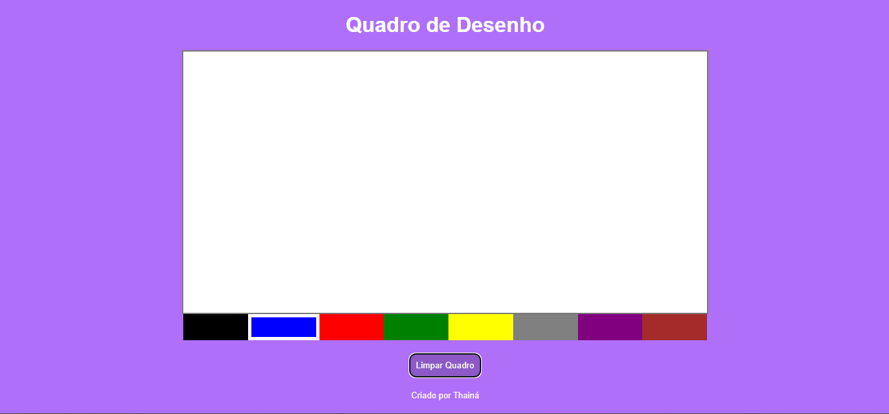

# Project Drawing Board

Bem-vindo ao **Project Drawing Board**, um quadro de desenho interativo criado com JavaScript, HTML e CSS. Este projeto permite que os usuários desenhem diretamente no quadro usando uma paleta de cores e oferece a opção de limpar o quadro com um simples clique.

## Funcionalidades

- **Desenho Interativo**: Desenhe no quadro utilizando o mouse.
- **Paleta de Cores**: Escolha entre várias cores disponíveis para criar desenhos variados.
- **Botão Limpar**: Apague o conteúdo do quadro a qualquer momento com o botão "Limpar Quadro".
- **Interface Simples e Intuitiva**: Interface amigável, desenvolvida com foco em facilidade de uso.

## Tecnologias Utilizadas

- **HTML5**
- **CSS3**
- **JavaScript**

## Como Usar

1. Clone este repositório:
    ```bash
    git clone https://github.com/seu-usuario/project-drawing-board.git
    ```

2. Navegue até o diretório do projeto:
    ```bash
    cd project-drawing-board
    ```

3. Abra o arquivo `index.html` no seu navegador:
    ```bash
    start index.html
    ```

4. Comece a desenhar no quadro, escolhendo a cor desejada na paleta. Para limpar o quadro, clique no botão "Limpar Quadro".

## Captura de Tela



## Contribuição

Contribuições são bem-vindas! Sinta-se à vontade para abrir um pull request ou reportar issues.

## Licença

[](]https://github.com/ThainaSantoss/ThainaSantoss.github.io/blob/main/LICENSE)
Este projeto está licenciado sob a licença MIT.

---

Criado por [Thainá dos Santos Silva](https://github.com/ThainaSantoss).
